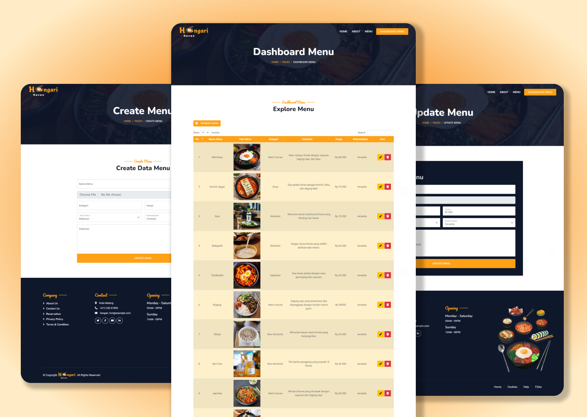
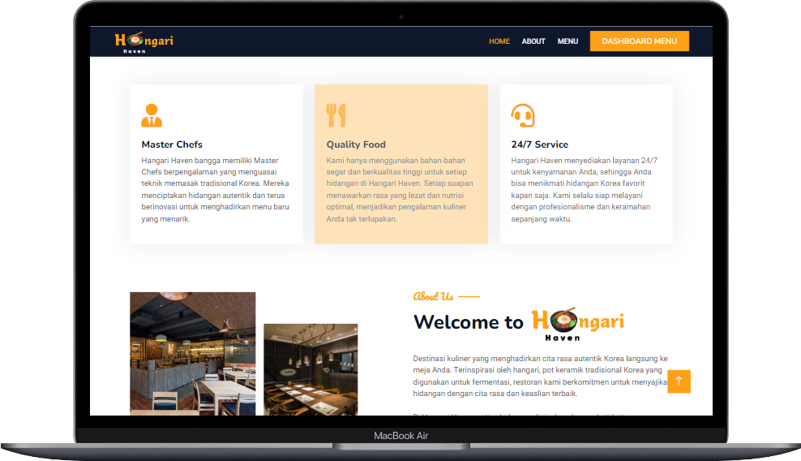
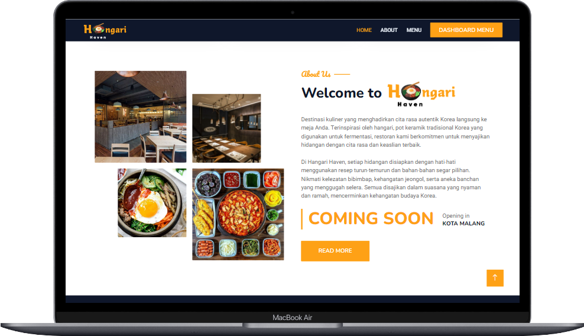
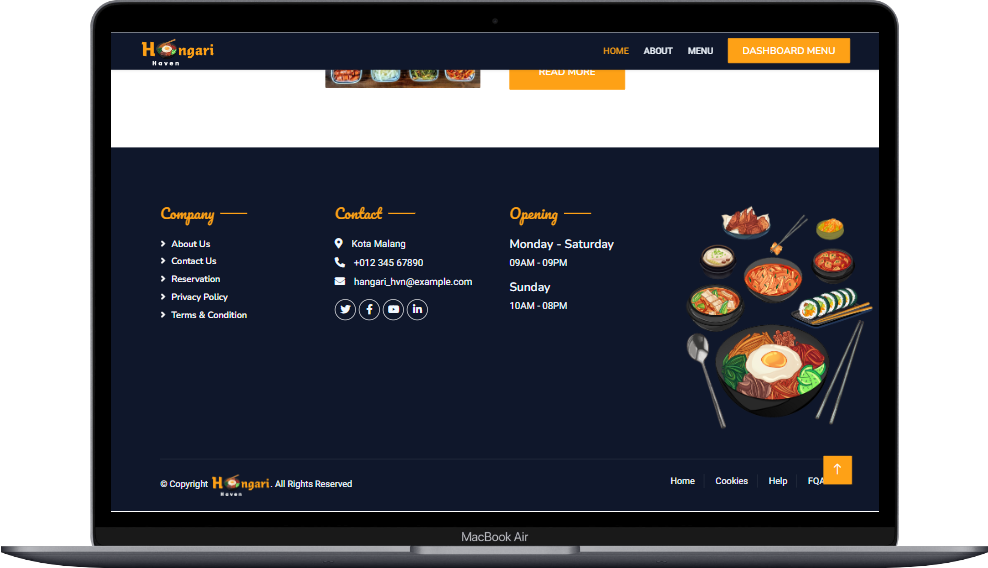
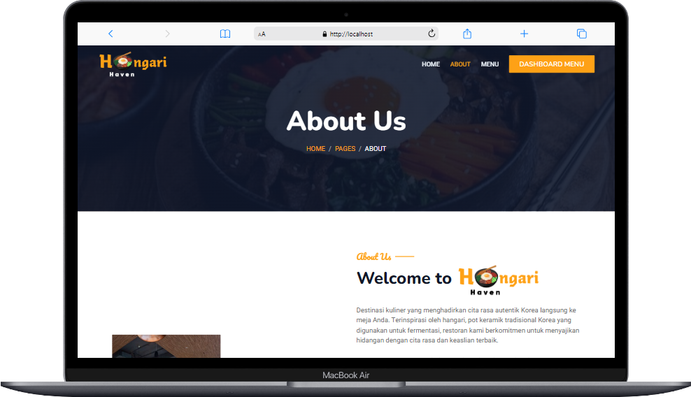
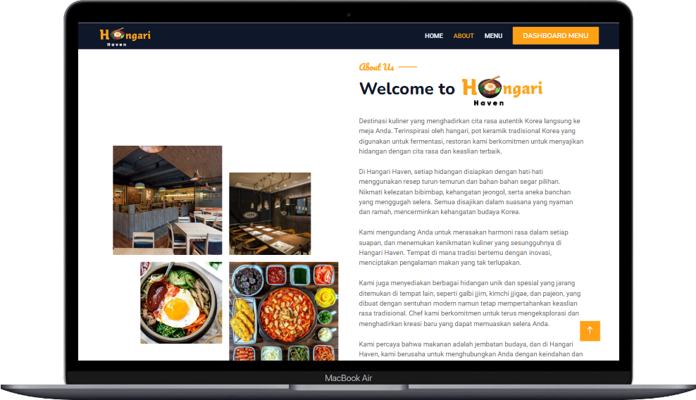
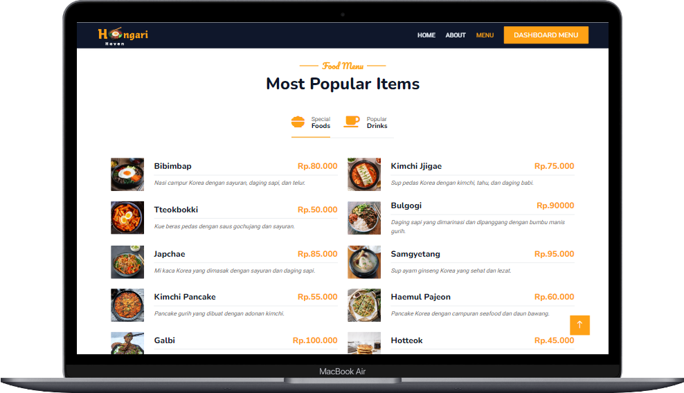
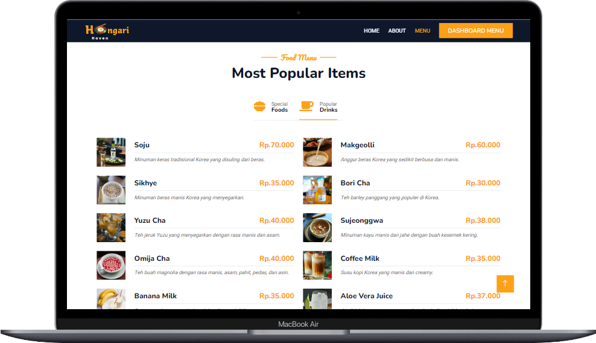
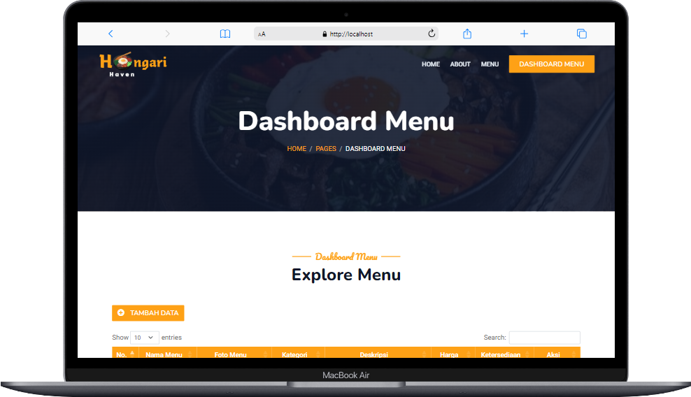
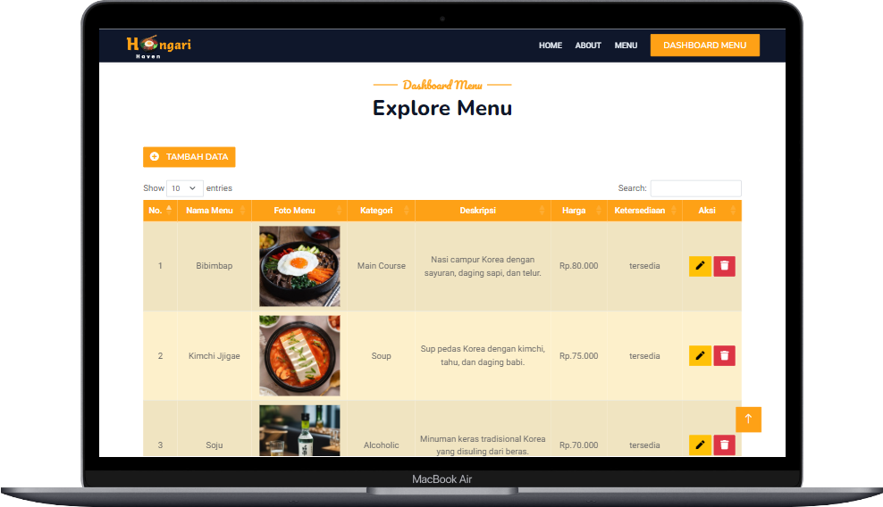

<p align="center"><a href="https://github.com/ZuyinatinK/restful-xml-restoran"></a></p>
<h1 align="center">Hangari Haven | Restful XML Restoran</h1>

Hangari Haven adalah sebuah website restoran Korea yang dirancang untuk mempromosikan restoran, memberikan informasi kepada pelanggan, dan menampilkan menu lengkap dengan deskripsi serta harga makanan dan minuman. Website ini juga dilengkapi dengan fitur CRUD (Create, Read, Update, Delete) dan upload foto menu, memungkinkan admin untuk menambah, mengubah, menghapus, dan mengunggah foto menu. Data menu ini akan tersimpan di server dan dapat dilihat oleh pelanggan melalui website. Website ini merupakan program matakuliah Sistem Terdistribusi dan Keamanan.

## Preview 🚀
Website **Hangari Haven** memungkinkan pelanggan restoran untuk melihat daftar menu, suasana restoran, dan foto koki. Admin dapat menambahkan, memperbarui, menghapus, dan mengunggah foto menu secara langsung melalui antarmuka admin.





## Daftar Isi

1. [Tentang Hangari Haven](#tentang-hangari-haven)
2. [Fitur Utama](#fitur-utama)
3. [Teknologi yang Digunakan](#teknologi-yang-digunakan)
4. [Download dan Install](#download-dan-install)
5. [Persyaratan](#persyaratan)
6. [Struktur Direktori](#struktur-direktori)
7. [Persiapan Sistem Operasi Debian Server 11.05](#persiapan-sistem-operasi-debian-server-1105)
   1. [Installasi dan Konfigurasi Debian Server](#installasi-dan-konfigurasi-debian-server)
   2. [Installasi XAMPP di Debian Server](#installasi-xampp-di-debian-server)
   3. [Jalankan XAMPP saat Booting](#jalankan-xampp-saat-booting)
8. [Langkah-langkah Instalasi Program](#langkah-langkah-instalasi-program)
   1. [Konfigurasi PHP](#konfigurasi-php)
   2. [Clone Repository dan Konfigurasi Direktori](#clone-repository-dan-konfigurasi-direktori)
   3. [Konfigurasi Database](#konfigurasi-database)
   4. [Penyesuaian URL di Client](#penyesuaian-url-di-client)
   5. [Mengakses Aplikasi](#mengakses-aplikasi)
9. [Preview Tampilan Website](#preview-tampilan-website)
10. [Kesimpulan](#kesimpulan)
11. [Kontributor](#kontributor)

## Tentang Hangari Haven
**Hangari Haven** adalah platform digital yang dikembangkan untuk restoran Korea agar dapat mempromosikan bisnis mereka secara lebih efektif. Dengan menggunakan **RESTful API** berbasis **XML**, admin dapat mengelola data menu seperti menambah, mengubah, dan menghapus data, termasuk upload foto menu yang akan tersimpan di server. 

Sistem ini memanfaatkan **Debian Server** sebagai backend dan **Windows 10** sebagai client, di mana seluruh data disimpan dan dikelola melalui server, dan pelanggan dapat mengaksesnya melalui client.

## Fitur Utama
- **Promosi Restoran**: Menampilkan tema, suasana, foto koki, dan informasi restoran lainnya.
- **Daftar Menu Restoran**: Daftar makanan dan minuman lengkap dengan deskripsi dan harga.
- **CRUD Restful XML**: Fitur untuk menambah, mengedit, menghapus item menu melalui RESTful API berbasis XML.
- **Upload Foto Menu**: Fitur untuk mengunggah dan menyimpan foto menu di server.
- **Database Terdistribusi**: Data tersimpan di server Debian dan dapat diakses oleh client melalui RESTful API.

## Teknologi yang Digunakan
- **PHP 5.6.40**: Sebagai bahasa pemrograman utama untuk backend.
- **JavaScript**: Untuk interaksi dinamis di sisi client.
- **HTML/CSS/SCSS**: Untuk membangun antarmuka pengguna yang responsif.
- **Bootstrap 5**: Framework CSS yang responsif untuk mendesain tampilan yang modern dan responsive.
- **MySQL**: Untuk manajemen dan penyimpanan data menu restoran.
- **RESTful API** dengan format **XML**: Untuk pertukaran data antara client dan server.
- **Debian Server 11.05**: Sebagai server utama untuk penyimpanan dan proses backend.
- **Windows 10**: Bertindak sebagai client yang mengirimkan permintaan CRUD ke server.
- **XAMPP** dengan PHP Version **5.6.40** di kedua sistem operasi.

## Download dan Install
1. Download [VirtualBox 6.1](https://www.virtualbox.org/wiki/Download_Old_Builds_6_1) dan lakukan installasi pada windows.
2. Download [ISO Debian](https://cdimage.debian.org/debian-cd/current/amd64/iso-cd/) dan lakukan installasi pada VirtualBox
3. Download [XAMPP dengan PHP 5.6](https://sourceforge.net/projects/xampp/files/XAMPP%20Windows/5.6.40/) dan lakukan installasi pada windows.

## Persyaratan
- Windows sebagai client dengan IP Address `192.168.10.1`.
- Debian server 11.05 sebagai server dengan IP Address `192.168.10.13`.
- XAMPP dengan PHP versi 5.6 di kedua sistem operasi.

## Struktur Direktori

```plaintext
restful-xml-restoran/
│
├── client/
│   ├── css/
│   │   ├── bootstrap.min.css
│   │   ├── style.css
│   │   └── table.css
│   │
│   ├── img/
│   │
│   ├── js/
│   │   └── main.js
│   │
│   ├── lib/
│   │   ├── animate/
│   │   ├── counterup/
│   │   ├── easing/
│   │   ├── owlcarousel/
│   │   ├── tempusdominus/
│   │   ├── waypoints/
│   │   └── wow/
│   │
│   ├── scss/
│   │   ├── bootstrap\scss
│   │   └── bootstrap.scss
│   │
│   ├── about.php
│   ├── Client.php
│   ├── dashboard.php
│   ├── index.php
│   ├── menu.php
│   ├── koneksi.php
│   ├── proses.php
│   ├── tambah.php
│   └── ubah.php
│
├── server/
│   ├── images/ # Untuk menyimpan foto menu yang diunggah
│   │
│   ├── Database.php
│   └── server.php
│
├── database/
│   └── db_restoran.sql
│
├── Markdown/
│   ├── mockups/
│   └── preview/
│
└── README.md
```

## Persiapan Sistem Operasi Debian Server 11.05
### Installasi dan Konfigurasi Debian Server
1. Pastikan telah melakukan installasi VirtualBox 6.1.
2. Atur IP Address untuk Client Windows/Linux Desktop:
   - File -> Host Network Manager
   - Buat/konfigurasi `vboxnet`
   - IP Address Client: `192.168.10.1`
   - Network Mask: `255.255.255.0`
3. Create Virtual Machine Debian Server
   - Pilih file iso Debian Server yang telah di download
   - Settings storage
   - Pastikan ada 2 Adapter di Debian Server:
     - `Adapter 1 (NAT)`
     - `Adapter 2 (Host-only Adapter)`
   - NAT digunakan agar Debian Server dapat terkoneksi dengan internet.
   - Host-only Adapter digunakan agar Debian Server dapat di-remote dari Client.
   - Lakukan installasi Debian server
4. Partisi Debian Server harus ada partisi / (ext4) dan swap (disarankan kapasitas <= 1Gb).
5. Login sebagai superuser/root:
    ```
    $ root
    Password:
    ```
6. Setting Static IP Address:
    - Setting static IP Address
    - Adapter 1 -> NAT (DHCP) -> `enp0s3`
    - Adapter 2 -> Host-only Adapter (Static IP) -> `enp0s8`
       Ketik perintah:
        ```
        # nano /etc/network/interfaces
        ```
        Tambahkan code:
        ```
        auto lo
        iface lo inet loopback
        allow-hotplug enp0s3
        iface enp0s3 inet dhcp
        allow-hotplug enp0s8
        iface enp0s8 inet static
            address 192.168.10.13
            netmask 255.255.255.0
        ```
7. Restart networking:
    ```
    # /sbin/service networking restart
    ```
    Jika gagal, gunakan:
    ```
    # /sbin/ifdown enp0s3
    ```
    ```
    # /sbin/ifdown enp0s8
    ```
    ```
    # /sbin/ifup enp0s3
    ```
    ```
    # /sbin/ifup enp0s8
    ```
    Jika masih tidak berhasil, jalankan:
   ```sh
   # /sbin/reboot
   ```
   
8. Cek IP Address:
    ```sh
   # ip address
   ```
   atau
   ```sh
   # ip a
   ```

### Installasi XAMPP di Debian Server
1. Install dependencies:
    ```
    # apt-get install -y net-tools wget zip unzip rar unrar
    ```
2. Download XAMPP dan install:
    ```
    $ sudo chmod +x /home/name/xampp-linux-x64-5.6.40-1-installer.run
    ```
    ```
    $ sudo /home/name/xampp-linux-x64-5.6.40-1-installer.run
    ```
3. Konfigurasi Apache:
    ```
    $ sudo nano /opt/lampp/etc/httpd.conf
    ```
    ```
    #User daemon
    #Group daemon
        User name
        Group name
    ```
4. Ubah kepemilikan direktori htdocs:
    ```
    $ sudo chown -RP name:name /opt/lampp/htdocs
    ```
5. Buat symbolic link:
    ```
    $ sudo ln -s /opt/lampp/htdocs/ /home/name/htdocs
    ```
6. Konfigurasi phpMyAdmin:
    ```
    $ sudo nano /opt/lampp/etc/extra/httpd-xampp.conf
    ```
    ```
    $ sudo nano /opt/lampp/phpmyadmin/config.inc.php
    ```
    ```
    $cfg['blowfish_secret'] = '12345678901234567890123456789012';
    ```
7. Restart XAMPP:
    ```
    $ sudo /opt/lampp/lampp restart
    ```
8. Akses phpMyAdmin melalui:
    ```
    https://192.168.10.13/phpmyadmin
    ```

### Jalankan XAMPP saat Booting
1. Crontab:
    ```
    $ sudo crontab -e
    ```
    ```
    @reboot /opt/lampp/lampp startmysql
    @reboot /opt/lampp/lampp startapache
    ```
2. RC.Local:
    ```
    $ sudo touch /etc/rc.local
    ```
    ```
    $ sudo chmod +x /etc/rc.local
    ```
    ```
    $ sudo nano /etc/rc.local
    ```
    diisi dengan:
    ```
    #!/bin/sh -e
    ```
    ```
    /opt/lampp/lampp startmysql
    /opt/lampp/lampp startapache
    exit 0
    ```
    Kemudian `Reboot`.
    
    ```
    $ sudo /sbin/reboot
    ```

## Langkah-langkah Instalasi Program
1. Pastikan sudah melakukan installasi Debian Server 11.05
2. Pastikan sudah setting IP untuk komunikasi antara client dan server:
    - IP Debian Server (Server): `192.168.10.13`
    - IP Windows 10 (Client): `192.168.10.1`
3. Pastikan sudah melakukan installasi XAMPP di Windows 10 dan Debian Server dengan PHP versi 5.6.40.

### Konfigurasi PHP
1. Masuk ke dalam directory `C:\xampp\php\php.ini` pada file php.ini ubah pengaturan pada:
    ```
    ;extension=php_sockets.dll
    short_open_tag=Off
    ```
    menjadi:
    ```
    ;extension=php_sockets.dll
    short_open_tag=On
    ```
    > Kemudian `Restart Apache` di XAMPP Control Panel.
    
2. Akses **phpinfo** di Windows dan pastikan ekstensi PHP **xml** sudah aktif.
    Akses melalui:
    ```
    http://localhost/dashboard/phpinfo.php
    ```
2. Akses **phpinfo** di Debian Server dan pastikan ekstensi PHP lainnya seperti **xml**, **PDO**, dan **pdo_mysql** sudah aktif.
    Akses melalui:
    ```
    192.168.10.13/dashboard/phpinfo.php
    ```

### Clone Repository dan Konfigurasi Direktori
1. Buat folder `restful-xml-restoran` di `xampp/htdocs` pada Windows 10.
2. Clone repository project ke dalam folder tersebut:
    ```
    https://github.com/ZuyinatinK/restful-xml-restoran.git
    ```
3. Tempatkan folder client di `/xampp/htdocs/restful-xml-restoran/client` pada Windows 10.
4. Tempatkan folder server di `/opt/lampp/htdocs/restful-xml-restoran/server` pada Debian Server.

### Konfigurasi Database
1. Buat database baru bernama `db_restoran` di **phpMyAdmin** pada **Debian Server**.
2. Import file `db_restoran.sql` yang terdapat di folder `database/` ke MySQL melalui **phpMyAdmin** atau tool database lainnya.
3. Edit pada `/opt/lampp/htdocs/restful-xml-restoran/server/Database.php` di Debian Server untuk mengatur koneksi database sesuai dengan server lokal:
    ```
     // Properti untuk menyimpan informasi koneksi database
        private $host = "localhost";
        private $dbname = "db_restoran";
        private $user = "root";
        private $password = "";
        private $port = "3306";
        private $conn;
    
        /**
         * Construct untuk membuat koneksi ke database
         */
        public function __construct()
        {
            try {
                // Membuat koneksi PDO ke database
                $this->conn = new PDO("mysql:host=$this->host;port=$this->port;dbname=$this->dbname;charset=utf8", $this->user, $this->password);
            } catch (PDOException $e) {
                // Menangani kesalahan koneksi
                echo "Koneksi gagal: " . $e->getMessage();
            }
        }
    ```

### Penyesuaian URL di Client
Edit file `/xampp/htdocs/restful-xml-restoran/client/Client.php` dengan URL server Debian:
```
$url = 'http://192.168.10.13/restful-xml-restoran/server/server.php';
$abc = new Client($url);
```
### Mengakses Aplikasi
1. Untuk mengakses RESTful API server, buka browser di Windows 10 dan akses:
    ```
    http://192.168.10.13/restful-xml-restoran/server/server.php
    ```
2. Untuk mengakses website client, buka browser di Windows 10 dan akses:
    ```
    http://localhost/restful-xml-restoran/client/index.php
    ```

## Preview Tampilan Website
Website ini memiliki antarmuka yang responsif dan modern berkat penggunaan Bootstrap 5. Beberapa halaman utama yang ditampilkan adalah sebagai berikut:

- Home

    
    
    

    

    

- About

    

    

    

- Menu

    

    

    
    
- Dashboard Menu

    

    


## Kesimpulan
Program Hangari Haven adalah solusi digital yang membantu restoran dalam mempromosikan bisnis mereka melalui platform web modern. Dengan fitur CRUD dan upload foto menu, website ini memudahkan pengelolaan menu secara efisien dan memungkinkan pelanggan melihat menu secara langsung. Instalasi dan konfigurasi yang terstruktur menjadikan website ini mudah diimplementasikan di lingkungan Debian Server dan Windows 10.

## Kontributor

Proyek ini dikembangkan sebagai tugas Mata Kuliah **Sistem Terdistribusi dan Keamanan** pada tahun 2021 oleh **Zuyinatin Khofifah**. Proyek ini dibuat dengan tujuan memberikan pengalaman praktis dalam membangun **sistem terdistribusi berbasis RESTful API dan keamanan data**.
